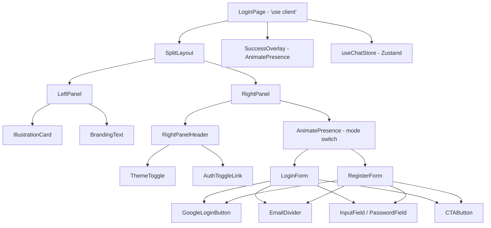

# Design Document: Login & Register Redesign

## Overview

Redesign halaman `/login` dari single-card layout menjadi split-screen layout dua kolom bergaya SaaS/fintech modern. Sisi kiri (LeftPanel) menampilkan ilustrasi dekoratif dan branding dengan background cream (`#f0ede8`). Sisi kanan (RightPanel) menampilkan form autentikasi (login atau register) dengan Google social login, email divider, input fields bervalidasi inline, dan CTA button biru solid.

Perubahan dilakukan hanya pada dua file:
- `app/login/page.tsx` — komponen utama yang direfaktor
- `app/globals.css` — CSS classes baru untuk split layout

Auth state tetap dikelola via Zustand (`useChatStore`). Tidak ada backend call nyata; submit form mensimulasikan autentikasi dengan redirect ke `/` setelah 1200ms.

---

## Architecture



**Alur state:**
1. `LoginPage` menyimpan `mode: 'login' | 'register'`, `submitted: boolean`, dan per-form field state + error state.
2. Toggle mode memicu animasi slide horizontal via `AnimatePresence`.
3. Submit valid → `submitted = true` → `SuccessOverlay` fade-in → setelah 1200ms `setIsAuthenticated(true)` + `router.push('/')`.
4. Theme dibaca dari `useChatStore.theme` dan diaplikasikan via `data-theme` attribute pada `<html>` (sudah dihandle di `providers.tsx`).

---

## Components and Interfaces

### SplitLayout

Wrapper utama halaman. Dua kolom side-by-side pada `md:` breakpoint ke atas.

```
<div class="auth-split-layout">
  <LeftPanel />        {/* hidden di mobile */}
  <RightPanel />
</div>
```

### LeftPanel

Hanya dirender pada `md:` ke atas (conditional render, bukan CSS hide).

```tsx
// Hanya dirender jika !isMobile
{!isMobile && <LeftPanel />}
```

Konten:
- Background cream `#f0ede8`
- `IllustrationCard`: SVG dekoratif geometris/abstract
- Nama aplikasi + tagline sebagai branding
- Animasi: fade-in dari kiri saat mount, delay 150ms setelah RightPanel

### RightPanel

Selalu dirender. Berisi:
- Header row: `AuthToggleLink` di pojok kanan atas
- Form area: `AnimatePresence` untuk slide horizontal antar mode
- `ThemeToggle` di pojok kanan atas (di dalam header row)

### AuthToggleLink

```tsx
interface AuthToggleLinkProps {
  mode: 'login' | 'register';
  onToggle: () => void;
}
```

Teks berubah sesuai mode:
- Login mode: "Don't have an account? **Sign up**"
- Register mode: "Already have an account? **Sign in**"

### GoogleLoginButton

Full-width, outlined style. Logo Google SVG multicolor inline. Handler kosong (no-op) untuk saat ini.

```tsx
interface GoogleLoginButtonProps {
  onClick?: () => void;
}
```

### EmailDivider

Teks "Or continue with email address" diapit dua garis horizontal.

### InputField

```tsx
interface InputFieldProps {
  id: string;
  label: string;
  type: string;
  value: string;
  onChange: (v: string) => void;
  icon: React.ElementType;
  placeholder?: string;
  error?: string;          // pesan error inline
  rightSlot?: React.ReactNode;
}
```

Error ditampilkan sebagai `<p>` di bawah input dengan warna merah.

### PasswordField

Extends `InputField` dengan toggle show/hide password. `aria-label` berubah sesuai state.

### CTAButton

```tsx
interface CTAButtonProps {
  label: string;
  loading: boolean;
  disabled?: boolean;
}
```

Loading state: spinner icon + teks berubah menjadi "Signing in…" / "Creating account…". `disabled` saat loading.

### SuccessOverlay

Full-screen overlay dengan checkmark icon, teks "You're in", dan subtitle redirect. Animasi fade-in + scale.

### ThemeToggle

Tombol bulat di pojok kanan atas RightPanel. Toggle antara Sun/Moon icon dengan animasi rotate.

---

## Data Models

### FormState (per form)

```typescript
// LoginForm local state
interface LoginFormState {
  email: string;
  password: string;
  errors: {
    email?: string;
    password?: string;
  };
}

// RegisterForm local state
interface RegisterFormState {
  username: string;
  email: string;
  password: string;
  confirm: string;
  errors: {
    username?: string;
    email?: string;
    password?: string;
    confirm?: string;
  };
}
```

### Validation Rules

```typescript
const VALIDATION = {
  email: (v: string) =>
    /^[^\s@]+@[^\s@]+\.[^\s@]+$/.test(v.trim())
      ? null
      : 'Please enter a valid email address',

  passwordMin: (v: string) =>
    v.length >= 8
      ? null
      : 'Password must be at least 8 characters',

  passwordMatch: (p: string, c: string) =>
    p === c
      ? null
      : 'Passwords do not match',

  required: (v: string) =>
    v.trim().length > 0
      ? null
      : 'This field is required',
};
```

Validasi dijalankan saat CTAButton diklik (on-submit), bukan on-change, untuk menghindari error prematur.

### CSS Classes Baru (globals.css)

| Class | Deskripsi |
|---|---|
| `auth-split-layout` | Flex container dua kolom, full-height |
| `auth-left-panel` | 50% width, background cream, flex center |
| `auth-right-panel` | 50% width, flex center, overflow-y auto |
| `auth-illustration-card` | Card dalam LeftPanel, rounded, shadow |
| `auth-google-btn` | Outlined button, full-width |
| `auth-email-divider` | Flex row dengan garis dan teks tengah |
| `auth-input-error` | Teks error merah di bawah input |

Dark mode overrides via `[data-theme="dark"]` selector untuk semua class baru.

---

## Correctness Properties

*A property is a characteristic or behavior that should hold true across all valid executions of a system — essentially, a formal statement about what the system should do. Properties serve as the bridge between human-readable specifications and machine-verifiable correctness guarantees.*

### Property 1: Toggle mode adalah involusi

*For any* mode awal (`'login'` atau `'register'`), melakukan toggle dua kali SHALL menghasilkan mode yang identik dengan mode awal — yaitu `toggleMode(toggleMode(m)) === m`.

**Validates: Requirements 3.4**

---

### Property 2: Validasi email menolak semua string tanpa "@"

*For any* string yang tidak mengandung karakter `"@"`, fungsi `validateEmail` SHALL mengembalikan pesan error non-null.

**Validates: Requirements 7.7**

---

### Property 3: Validasi email menerima format email yang valid

*For any* string berformat email valid (mengandung `"@"` dan domain dengan setidaknya satu `"."`), fungsi `validateEmail` SHALL mengembalikan `null`.

**Validates: Requirements 7.7**

---

### Property 4: Validasi password menolak semua string dengan panjang < 8

*For any* string dengan `length < 8`, fungsi `validatePasswordMin` SHALL mengembalikan pesan error non-null.

**Validates: Requirements 7.8**

---

### Property 5: Validasi konfirmasi password — kesamaan string ↔ tidak ada error

*For any* dua string `a` dan `b`, `validatePasswordMatch(a, b) === null` jika dan hanya jika `a === b`. Dengan kata lain: string identik selalu lolos, string berbeda selalu menghasilkan error.

**Validates: Requirements 7.9**

---

### Property 6: Required field menolak semua string whitespace-only

*For any* string yang seluruh karakternya adalah whitespace (spasi, tab, newline), fungsi `validateRequired` SHALL mengembalikan pesan error non-null.

**Validates: Requirements 7.6**

---

### Property 7: Setiap input field memiliki label yang terhubung via htmlFor

*For any* input element yang dirender oleh `LoginForm` atau `RegisterForm`, SHALL terdapat elemen `<label>` dengan atribut `htmlFor` yang nilainya sama dengan `id` input tersebut.

**Validates: Requirements 9.2**

---

## Error Handling

| Skenario | Penanganan |
|---|---|
| Required field kosong saat submit | Error inline di bawah field, tidak ada navigasi |
| Email format tidak valid | Pesan "Please enter a valid email address" |
| Password < 8 karakter (register) | Pesan "Password must be at least 8 characters" |
| Konfirmasi password tidak cocok | Pesan "Passwords do not match" |
| Username kosong (register) | Pesan "This field is required" |
| Google login diklik | No-op (handler kosong, tidak ada error) |

Error state di-reset saat user mulai mengetik di field yang bersangkutan (opsional, untuk UX lebih baik) atau saat submit berikutnya.

---

## Testing Strategy

### Unit Tests

Fokus pada contoh spesifik dan edge case:

- Render `LoginForm` → memastikan semua elemen hadir (email input, password input, Google button, divider, CTA)
- Render `RegisterForm` → memastikan semua elemen hadir (username, email, password, confirm, Google button)
- `AuthToggleLink` menampilkan teks yang benar untuk setiap mode
- Submit `LoginForm` dengan field kosong → error ditampilkan, tidak ada navigasi
- Submit `RegisterForm` dengan password mismatch → error "Passwords do not match"
- `LeftPanel` tidak dirender pada viewport < 768px (mock `useMediaQuery` atau `window.innerWidth`)
- `SuccessOverlay` muncul setelah submit valid

### Property-Based Tests

Library: **fast-check** (sudah terinstall sebagai devDependency)

Setiap property test dikonfigurasi minimum **100 iterasi**.

Setiap test diberi tag komentar:
`// Feature: login-register-redesign, Property N: <property_text>`

**Property 1 — Toggle mode adalah involusi**
```typescript
// Feature: login-register-redesign, Property 1: toggleMode(toggleMode(m)) === m for any mode
fc.assert(fc.property(
  fc.constantFrom('login' as const, 'register' as const),
  (mode) => toggleMode(toggleMode(mode)) === mode
), { numRuns: 100 });
```

**Property 2 — Email validation menolak string tanpa "@"**
```typescript
// Feature: login-register-redesign, Property 2: validateEmail returns non-null for strings without @
fc.assert(fc.property(
  fc.string().filter(s => !s.includes('@')),
  (s) => validateEmail(s) !== null
), { numRuns: 100 });
```

**Property 3 — Email validation menerima format email valid**
```typescript
// Feature: login-register-redesign, Property 3: validateEmail returns null for valid email addresses
fc.assert(fc.property(
  fc.emailAddress(),
  (email) => validateEmail(email) === null
), { numRuns: 100 });
```

**Property 4 — Password validation menolak string dengan panjang < 8**
```typescript
// Feature: login-register-redesign, Property 4: validatePasswordMin returns non-null for strings shorter than 8 chars
fc.assert(fc.property(
  fc.string({ maxLength: 7 }),
  (s) => validatePasswordMin(s) !== null
), { numRuns: 100 });
```

**Property 5 — Password match: null ↔ string identik**
```typescript
// Feature: login-register-redesign, Property 5: validatePasswordMatch(a,b) === null iff a === b
fc.assert(fc.property(
  fc.string(), fc.string(),
  (a, b) => (a === b) === (validatePasswordMatch(a, b) === null)
), { numRuns: 100 });
```

**Property 6 — Required field menolak whitespace-only**
```typescript
// Feature: login-register-redesign, Property 6: validateRequired returns non-null for whitespace-only strings
fc.assert(fc.property(
  fc.stringOf(fc.constantFrom(' ', '\t', '\n')),
  (s) => validateRequired(s) !== null
), { numRuns: 100 });
```

**Property 7 — Setiap input field memiliki label htmlFor**
```typescript
// Feature: login-register-redesign, Property 7: every rendered input has a matching label with htmlFor
// Diimplementasikan sebagai unit test yang iterates semua input dalam render output LoginForm dan RegisterForm
// dan memverifikasi kehadiran label yang sesuai untuk setiap input id.
```

### Dual Testing Rationale

Unit tests menangkap bug konkret pada contoh spesifik dan integrasi antar komponen. Property tests memverifikasi kebenaran umum fungsi validasi terhadap ribuan input acak, memastikan tidak ada edge case yang terlewat. Keduanya saling melengkapi.
